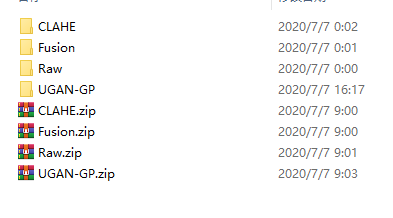

# Underwater Multiple Object Tracking Dataset

This is a dataset for multiple object tracking in underwater environment. The only target in the dataset is holothurian. So far as we know, the need for holothurian is growing fast in China in recent years,, which encourages the development of holothurian aquaculture. The farmers need to know the abundance and distribution of the holothurian, so that they can evaluate the growth status and decide the right time to harvest. However, traditional method requires farmers to employ a diver to do the counting. However, that cost of hiring divers is high and there are not enough divers. Therefore, it is necessary to develop an in-situ non-contact holothurian counting system. And that is what we make this dataset for. The whole dataset is composed of two parts, part 1 is made for training the detector and part 2 is made for evaluating the performance of tracking and counting. We make the part 2 in the same format as [MOT16](https://motchallenge.net/data/MOT16/)


## Download

The dataset can be downloaded by [Baidu Netdisk](https://pan.baidu.com/s/1JRjW8TjbT-TW60kHY18yWg) code:uk7x  

## Underwater MOT dataset(Part 1)

This part is made for training the detector. The dataset is labeled in the same format as [VOC2007](http://host.robots.ox.ac.uk/pascal/VOC/index.html)

## Underwater MOT dataset(Part 2)

There are four zip files in total. Download them and unzip you can get four folders. The "Raw" folder is the original dataset without underwate enhancement. "CLAHE","Fusion" and "UGAN-GP" are the enhanced ones by [CLAHE](https://link.springer.com/article/10.1023/B:VLSI.0000028532.53893.82), [Fusion](https://ieeexplore.ieee.org/abstract/document/6247661/) and [UGAN-GP](https://ieeexplore.ieee.org/abstract/document/8460552).

  

The structure of each folder is as follow:(take "Raw" as an example)

```
─Raw
    ├─2019-05-11_06.31.53
    │  ├─det
    |  |  └─det.txt
    │  ├─gt
    |  |  └─gt.txt
    │  └─img1
    |     ├─1.jpg
    |     ├─2.jpg
    |     ...
    ├─2019-05-11_06.36.47
    │  ├─det
    │  ├─gt
    │  └─img1
    |  ...
```

Folder "img1" stores the sequence of the video. File "det.txt" records the detection ground truth of the images in "img1". Filer "gt.txt" records the tracking ground truth of the images in "img1". The format of "det.txt" and "gt.txt" are as follows:

- "det.txt"

```
<frame>, <id>, <bb_left>, <bb_top>, <bb_width>, <bb_height>, <confidence>, <x>, <y>, <z>
1,-1,296,423,84,55,0.999984,-1,-1,-1
1,-1,949,371,108,47,0.99999094,-1,-1,-1
1,-1,1045,310,43,40,1.0,-1,-1,-1
...
```

- "gt.txt"

```
<frame>,<id>,<bb_left>,<bb_top>,<bb_w>,<bb_h>,<available>,<cls>,<visibility>
1,1,1490,376,80,56,1,1,1
2,1,1490,377,77,59,1,1,1
3,1,1488,380,86,59,1,1,1
```
Note: <x><y><z> in "det.txt" are reserved for 3D location. <cls> in "gt.txt" is "1" now, because only holothurians are labeled in this dataset.
